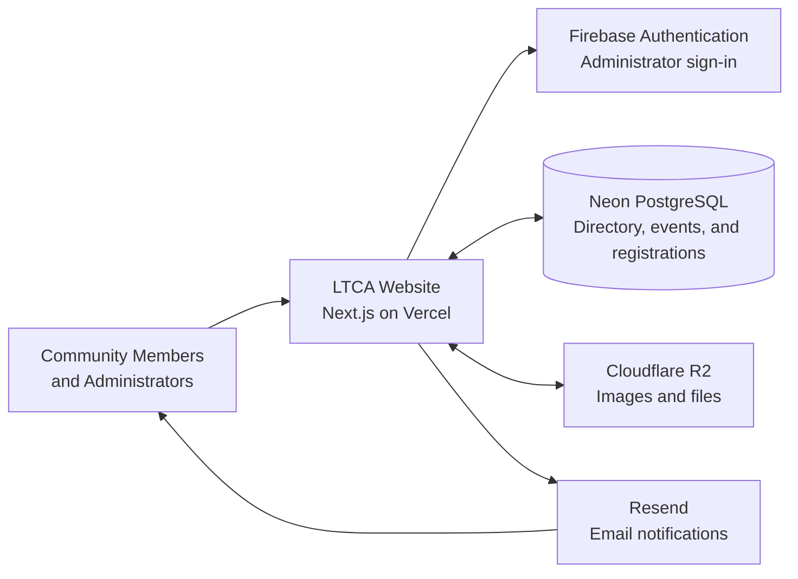

# Architecture Overview

This page provides a high-level overview of how the Lakay Toussaint Community Alliance website and its supporting services fit together. It is intended as a starting point for people who are new to the project.

The Next.js application is the central component. It serves the public website and administrator tools while connecting to managed services for authentication, application data, file storage, and email delivery.

## Community Members and Administrators

Community members use the public website to browse resources and events, submit businesses or services for the directory, and register for events.

Administrators use protected areas of the same application to review submissions and manage directory listings, events, and registrations.

## LTCA Website

The website is a Next.js application hosted on Vercel. It provides the user interface and server-side application logic for both the public website and the administrator experience.

The application coordinates requests between the user and the supporting services shown in the diagram.

## Firebase Authentication

Firebase Authentication manages administrator sign-in and verifies administrator identities. Passwords and other credentials are handled by Firebase rather than stored directly in the application database.

The application database may keep administrator profiles and permissions linked to their Firebase identity.

## Neon PostgreSQL

Neon provides the PostgreSQL database used for structured application data. This includes business directory entries, submission statuses, events, and event registrations.

PostgreSQL supports reliable relationships and transactions as the directory and event-management features grow.

## Cloudflare R2

Cloudflare R2 stores uploaded images and files, such as images representing businesses or community services. The PostgreSQL database stores references to these files rather than storing the files themselves.

## Resend

Resend delivers application email. Examples include notifying administrators about new submissions or registrations and confirming to community members that their information was received.

## Typical Request Flow

1. A community member or administrator interacts with the website.
2. The Next.js application validates and processes the request.
3. Administrator identity is verified through Firebase Authentication when required.
4. Application data is read from or written to Neon PostgreSQL.
5. Uploaded images or files are stored in Cloudflare R2.
6. The application uses Resend when an email notification or confirmation is needed.
