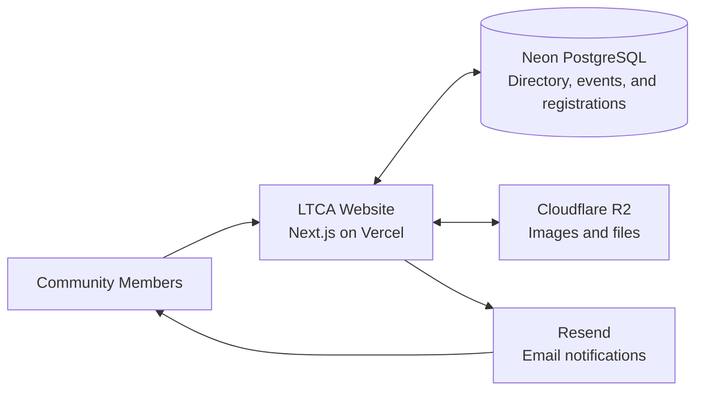

# Architecture Overview

This page provides a high-level overview of how the Lakay Toussaint Community Alliance website and its supporting services fit together. It is intended as a starting point for people who are new to the project.

```mermaid
flowchart LR
    People[Community Members] --> App[LTCA Website<br/>Next.js on Vercel]

    App <--> Database[(Neon PostgreSQL<br/>Directory, events, and registrations)]
    App <--> Storage[Cloudflare R2<br/>Images and files]
    App --> Email[Resend<br/>Email notifications]
    Email --> People
```

The Next.js application is the central component. It serves the public website while connecting to managed services for application data, file storage, and email delivery.

## Community Members

Community members use the public website to browse resources and events, submit businesses or services for the directory, and register for events.

## LTCA Website

The website is a Next.js application hosted on Vercel. It provides the public user interface and server-side application logic.

The application coordinates requests between the user and the supporting services shown in the diagram.

## Neon PostgreSQL

Neon provides the PostgreSQL database used for structured application data. This includes business directory entries, submission statuses, events, and event registrations.

PostgreSQL supports reliable relationships and transactions as the directory and event-management features grow.

## Cloudflare R2

Cloudflare R2 stores uploaded images and files, such as images representing businesses or community services. The PostgreSQL database stores references to these files rather than storing the files themselves.

## Resend

Resend delivers application email, including confirmations to community members that their information was received.

## Typical Request Flow

1. A community member interacts with the website.
2. The Next.js application validates and processes the request.
3. Application data is read from or written to Neon PostgreSQL.
4. Uploaded images or files are stored in Cloudflare R2.
5. The application uses Resend when an email notification or confirmation is needed.
